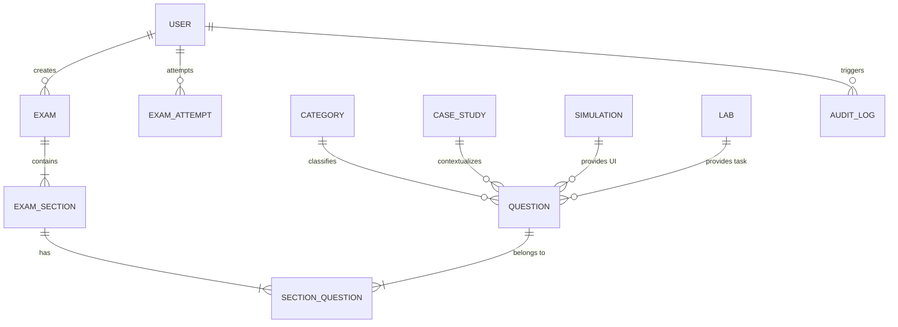

# NTMS Exam Platform - Database Architecture & Schema Specification

## Database Engine
- **Production Target**: Azure SQL Database (Serverless / Provisioned vCore)
- **Development Target**: SQLite / PostgreSQL / Azure SQL via Prisma ORM

## Entity Relationship Diagram (ERD) Overview

## Table Specifications

### 1. `users`
- `id`: String (UUID, PK)
- `entraId`: String (Unique, Nullable for Microsoft Entra ID integration)
- `email`: String (Unique)
- `name`: String
- `role`: Enum (`ADMINISTRATOR`, `EXAM_CREATOR`, `CANDIDATE`, `GUEST`)

### 2. `exams`
- `id`: String (UUID, PK)
- `code`: String (Unique)
- `title`: String
- `vendor`: Enum (`MICROSOFT`, `AWS`, `CISCO`, `VMWARE`, `LINUX`, `CUSTOM`, `UNIVERSITY`)
- `passingScore`: Float (default 70.0)
- `timeLimitMinutes`: Int

### 3. `questions`
- `id`: String (UUID, PK)
- `code`: String (Unique)
- `type`: Enum (16 types: `SINGLE_CHOICE`, `MULTIPLE_CHOICE`, `TRUE_FALSE`, `DROPDOWN`, `FILL_IN_BLANK`, `MATCHING`, `DRAG_AND_DROP`, `REORDER`, `BUILD_LIST`, `HOTSPOT`, `CASE_STUDY`, `SIMULATION`, `LAB`, `CODE_EDITOR`, `ESSAY`)
- `content`: String (JSON holding prompt, options, drag-drop targets, hotspot coords)
